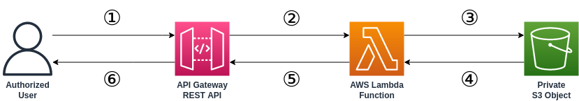

# S3 Presigner API

This project demonstrates how to set up a serverless application using Terraform to generate pre-signed URLs for a private S3 object with Lambda and API Gateway.

## Application overview

1. The user sends a request to the API Gateway endpoint with an API key (`x-api-key` header).
1. If the API key is valid, API Gateway invokes a Lambda function.
1. The Lambda function checks for a private object inside of an Amazon S3 bucket that it has access to.
1. If Lambda can access the object, the function generates a temporary pre-signed URL for the object (expires in 60 seconds).
1. The Lambda function returns the pre-signed URL as part of the function response to API Gateway.
1. API Gateway returns the pre-signed URL to the user as the API response.
